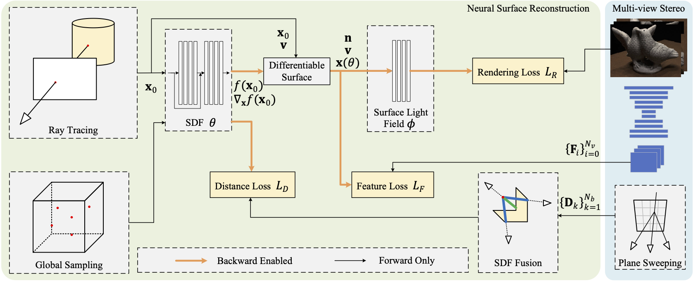

# MVSDF - Learning Signed Distance Field for Multi-view Surface Reconstruction



This is the official implementation for the ICCV 2021 paper [Learning Signed Distance Field for Multi-view Surface Reconstruction](https://arxiv.org/abs/2108.09964)

In this work, we introduce a novel neural surface reconstruction framework that leverages the knowledge of stereo matching and feature consistency to optimize the implicit surface representation. More specifically, we apply a signed distance field (SDF) and a surface light field to represent the scene geometry and appearance respectively. The SDF is directly supervised by geometry from stereo matching, and is refined by optimizing the multi-view feature consistency and the fidelity of rendered images. Our method is able to improve the robustness of geometry estimation and support reconstruction of complex scene topologies. Extensive experiments have been conducted on DTU, EPFL and Tanks and Temples datasets. Compared to previous state-of-the-art methods, our method achieves better mesh reconstruction in wide open scenes without masks as input.

# How to Use
## Environment Setup
The code is tested in the following environment (manually installed packages only). The newer version of the packages should also be fine.
```
dependencies:
  - cudatoolkit=10.2.89
  - numpy=1.19.2
  - python=3.8.8
  - pytorch=1.7.1
  - tqdm=4.60.0
  - pip:
    - cvxpy==1.1.12
    - gputil==1.4.0
    - imageio==2.9.0
    - open3d==0.13.0
    - opencv-python==4.5.1.48
    - pyhocon==0.3.57
    - scikit-image==0.18.3
    - scikit-learn==0.24.2
    - trimesh==3.9.13
    - pybind11==2.9.0
```
## Data Preparation
Download preprocessed DTU datasets from [here](https://hkustconnect-my.sharepoint.com/:u:/g/personal/jzhangbs_connect_ust_hk/EazyGuwPC5tIkbI3fgeERgEBBUXBV16_hIkud_dhS34wVw?e=CWjJGP)

## Training
``` sh
cd code
python training/exp_runner.py --data_dir <DATA_DIR>/scan<SCAN>/imfunc4 --batch_size 8 --nepoch 1800 --expname dtu_<SCAN>
```
The results will be written in `exps/mvsdf_dtu_<SCAN>`. 

## Trained Models
Download [trained models](https://hkustconnect-my.sharepoint.com/:u:/g/personal/jzhangbs_connect_ust_hk/Eagqe_XPyNhBh--lvtxjEVEBKCI-aXLWbRuxyi0jNqclKg?e=Jm9EaS) and put them in `exps` folder. This set of models achieve the following results. 

|      | Chamfer | PSNR  |
|------|---------|-------|
| 24   | 0.846   | 24.67 |
| 37   | 1.894   | 20.15 |
| 40   | 0.895   | 25.15 |
| 55   | 0.435   | 23.19 |
| 63   | 1.067   | 26.24 |
| 65   | 0.903   | 26.9  |
| 69   | 0.746   | 26.54 |
| 83   | 1.241   | 25.15 |
| 97   | 1.009   | 25.71 |
| 105  | 1.320   | 26.48 |
| 106  | 0.867   | 28.81 |
| 110  | 0.842   | 23.16 |
| 114  | 0.340   | 27.51 |
| 118  | 0.472   | 28.46 |
| 122  | 0.466   | 27.71 |
| Mean | 0.890   | 25.72 |

## Testing
``` sh
python evaluation/eval.py --data_dir <DATA_DIR>/scan<SCAN>/imfunc4 --expname dtu_<SCAN> [--eval_rendering]
```
add `--eval_rendering` flag to generate and evaluate rendered images. The results will be written in `evals/mvsdf_dtu_<SCAN>`.

## Trimming
```
cd mesh_cut
python setup.py build_ext -i  # compile
python mesh_cut.py <IN_OBJ> <OUT_OBJ> [--thresh 15 --smooth 10]
```
<span style="color:red">Note that this part of code can only be used for research purpose. Please refer to `mesh_cut/IBFS/license.txt`</span>

## Evaluation
Apart from the official implementation, you can also use my [re-implemented evaluation script](https://github.com/jzhangbs/DTUeval-python). 

# Citation
If you find our work useful in your research, please kindly cite
```
@article{zhang2021learning,
	title={Learning Signed Distance Field for Multi-view Surface Reconstruction},
	author={Zhang, Jingyang and Yao, Yao and Quan, Long},
	journal={International Conference on Computer Vision (ICCV)},
	year={2021}
}
```